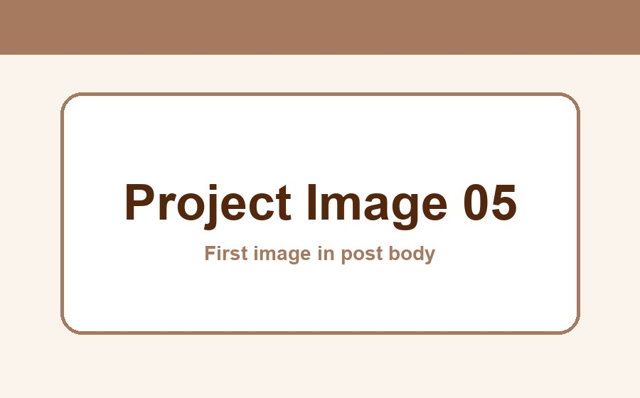

프로젝트 목록에서 상세 게시글로 이동하는 링크를 확인하기 위한 예시 글입니다.

## 프로젝트 소개

이 프로젝트는 게시글 상세 화면의 구성과 본문 탐색 경험을 확인하기 위한 예시입니다. 제목과 본문 사이의 간격, 태그 표현, 이미지 배치와 목차 이동을 함께 테스트합니다.

## 구현 과정

게시글을 읽는 흐름이 자연스럽도록 내용을 여러 구역으로 나누었습니다. 오른쪽 목차에서 각 항목을 선택하면 해당 위치로 바로 이동할 수 있습니다.

### 레이아웃 구성

본문은 읽기 편한 너비로 제한하고, 넓은 화면에서는 목차가 오른쪽에 고정되도록 구성합니다. 화면이 작아지면 본문에 집중할 수 있도록 목차가 자동으로 숨겨집니다.

### 이미지 표현

본문 이미지는 글의 흐름을 방해하지 않도록 콘텐츠 너비 안에서 표시합니다. 아래 이미지는 첨부 이미지의 크기와 모서리 스타일을 확인하기 위한 예시입니다.

## 주요 기능

- 본문 헤더를 이용한 자동 목차 생성
- 목차 항목을 선택했을 때 해당 구역으로 이동
- 현재 읽고 있는 구역을 목차에서 강조
- 데스크톱과 모바일에 맞춘 반응형 레이아웃

### 목차 활성화 확인

페이지를 아래로 스크롤하면 현재 화면에 가까운 헤더가 목차에서 강조됩니다. 각 목차 링크를 눌러 이동 동작도 확인할 수 있습니다.

## 마무리

이 구역은 목차의 마지막 항목과 긴 게시글에서의 스크롤 동작을 확인하기 위한 내용입니다. UI 확인이 끝나면 이 예시 내용은 자유롭게 수정하거나 제거할 수 있습니다.
